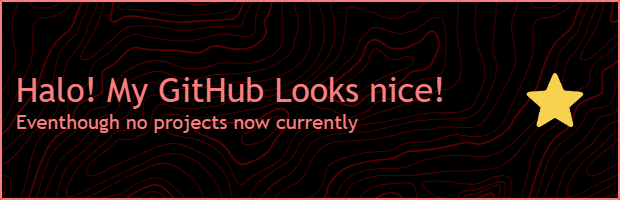

## Hi there 👋, I'm Adriansyah Alfarisyi (some mouthful name I know)
#### An Optimistic Lazybones 🌈

###

  

###

- 🔭 I’m currently working on re-arranging my life.
- 🌱 I’m currently [an Undergraduate College Student Semester 4](https://web.polines.ac.id/id/).

#### Skills 

  

#### 🎮 Games I've played before GTA 6
  

#### 🤙 Contact Me

#### 📊 Stats

 

### 🏆 GitHub Trophies

###

<picture>
  <source media="(prefers-color-scheme: dark)" srcset="https://raw.githubusercontent.com/Adriansyah67/Adriansyah67/output/pacman-contribution-graph-dark.svg">
  <source media="(prefers-color-scheme: light)" srcset="https://raw.githubusercontent.com/Adriansyah67/Adriansyah67/output/pacman-contribution-graph.svg">
  
</picture>

###

<!-- # 💫 About Me:
## Hi there 👋, I'm Adriansyah Alfarisyi (some mouthful name I know) #### An Optimistic Lazybones 🌈  
    
  - 🔭 I’m currently working on re-arranging my life. - 🌱 I’m currently [an Undergraduate College Student Semester 4](https://web.polines.ac.id/id/).

## 🌐 Socials:
 

# 💻 Tech Stack:
        
#  GitHub Stats:
 

###

- 🔭 I’m currently working on re-arranging my life. - 🌱 I’m currently [an Undergraduate College Student Semester 4](https://web.polines.ac.id/id/).

###

<picture>
  <source media="(prefers-color-scheme: dark)" srcset="https://raw.githubusercontent.com/Adriansyah67/Adriansyah67/output/pacman-contribution-graph-dark.svg">
  <source media="(prefers-color-scheme: light)" srcset="https://raw.githubusercontent.com/Adriansyah67/Adriansyah67/output/pacman-contribution-graph.svg">
  
</picture>

###

  

###
 -->

<!-- Proudly created with GPRM ( https://gprm.itsvg.in ) -->